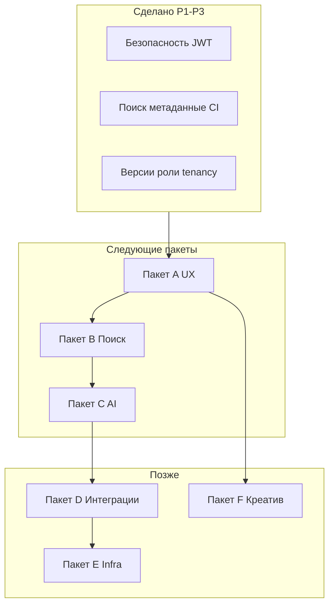

# Пакеты доработок (A–F)

Дорожная карта после волн **P1–P3** (смержены в `main`).  
Создание issues: `bash scripts/create_package_issues.sh`

---

## Обзор

| Пакет | Фокус | Эффект | Сложность |
|-------|--------|--------|-----------|
| **[A](#пакет-a--продукт-и-ux)** (#23–#28) | Продукт и UX | Высокий для ежедневной работы | Средняя |
| **[B](#пакет-b--умный-поиск)** | Семантика и релевантность | Отличие от «обычной» wiki | Средняя–высокая |
| **[C](#пакет-c--ai-ассистент-lite)** | LLM / RAG | «Вау» + экономия времени | Высокая |
| **[D](#пакет-d--коллаборация-и-интеграции)** | Команда и внешний мир | Enterprise-ready | Высокая |
| **[E](#пакет-e--инфраструктура-и-качество)** | Надёжность и compliance | Стабильные релизы | Средняя |
| **[F](#пакет-f--креатив-опционально)** | Визуал и вовлечение | Узнаваемый продукт | Средняя–высокая |



**Рекомендуемый порядок:** A → B → C → (параллельно E) → D → F.

---

## Пакет A — Продукт и UX

> Быстрые улучшения, которые почувствует вся команда.

| # | Задача | Описание |
|---|--------|----------|
| A1 | Тёмная тема | MUI `palette.mode`, переключатель в Header, `localStorage` |
| A2 | Черновики и публикация | `is_published`, «Опубликовать», гости видят только published |
| A3 | Шаблоны статей | Пресеты: How-to, Incident, ADR — структура контента в редакторе |
| A4 | Wiki-ссылки | Синтаксис `[[статья]]`, автолинк, страница backlinks |
| A5 | Экспорт | Markdown / PDF одной статьи или раздела (zip) |
| A6 | Дашборд | Недавние, популярные, устаревшие (>90 дней), мои черновики |

**Критерии готовности пакета:** редактор может работать в черновике, публиковать, связывать статьи и видеть обзор на главной.

---

## Пакет B — Умный поиск

> От ключевых слов к смыслу и контексту.

| # | Задача | Описание |
|---|--------|----------|
| B1 | Семантический поиск | pgvector + эмбеддинги `content_plain`, индекс при сохранении |
| B2 | Похожие статьи | Блок в сайдбаре статьи: top-5 по косинусной близости |
| B3 | Meilisearch (опц.) | Вынесенный поисковый движок для больших баз |
| B4 | UX поиска | Подсветка совпадений, синонимы, «искали также» |

**Зависимости:** стабильный `content_plain` (есть с P3).

---

## Пакет C — AI-ассистент (lite)

> ИИ только по контенту своей организации, с логированием.

| # | Задача | Описание |
|---|--------|----------|
| C1 | RAG Q&A | Чат «спроси базу знаний» с цитатами из статей org |
| C2 | Суммаризация | Кнопка «кратко» → 5–7 bullet points |
| C3 | Черновик из outline | Текстовый план → черновик статьи в редакторе |
| C4 | Проверка качества | Пустые ссылки, «слишком коротко», устаревшие даты |

**Требования:** API-ключ LLM в env, rate limit, opt-in на org.

---

## Пакет D — Коллаборация и интеграции

> Команда и связь с внешними инструментами.

| # | Задача | Описание |
|---|--------|----------|
| D1 | Комментарии и @mentions | Треды к статье, уведомления пользователю |
| D2 | Workflow ревью | Статусы draft → review → published, назначение ревьюера |
| D3 | Diff версий | Side-by-side сравнение двух `ArticleVersion` |
| D4 | Права на раздел | Object-level: editor только в своих ветках дерева |
| D5 | Публичный портал | `is_public` разделы, `/docs/{org}/{slug}`, SEO |
| D6 | Webhooks | События: publish, update, delete → URL клиента |
| D7 | Slack / Teams | Бот: поиск, ссылка на статью, «создать из треда» |
| D8 | Импорт | Batch Markdown/HTML из Confluence или Notion |

---

## Пакет E — Инфраструктура и качество

> Production-grade без «магии».

| # | Задача | Описание |
|---|--------|----------|
| E1 | E2E тесты | Playwright: login → CRUD → поиск → откат версии |
| E2 | Preview на PR | Временный URL из GitHub Actions |
| E3 | Audit log | Журнал действий (отдельно от версий контента) |
| E4 | Health / metrics | `/health/`, Prometheus-ready endpoints |
| E5 | 2FA и rate limit | Для admin и API |
| E6 | Закрыть старые Issues | Связать #10–#19 с PR #20–#22, закрыть дубликаты |

---

## Пакет F — Креатив (опционально)

> Узнаваемость и «изюминка» продукта.

| # | Задача | Описание |
|---|--------|----------|
| F1 | Граф знаний | Интерактивная карта статей и связей (force-graph) |
| F2 | 3D-полка | Альтернативный вид «библиотеки» (Three.js) |
| F3 | Закладки и «прочитано» | Персональные списки пользователя |
| F4 | Sandbox-разделы | TTL 30 дней, автоархив экспериментов |
| F5 | Геймификация | Бейджи, «статья недели» (опционально, выкл. по org) |
| F6 | Голос → статья | Whisper: аудио в транскрипт и черновик |

---

## Связь с закрытыми волнами P1–P3

| Было в roadmap | Развитие в пакетах |
|--------------|-------------------|
| P2 поиск | B1–B4 |
| P3 версии | D3 diff |
| P3 роли | D4 object-level |
| P3 Elasticsearch | B3 |
| P3 SSO/tenancy | D5 публичный портал, D7 интеграции |

---

## Ветки и PR (соглашение)

```
cursor/package-a-<feature>-6b26
cursor/package-b-...
```

Один пакет = один epic-PR или несколько PR по задачам A1, A2, …
